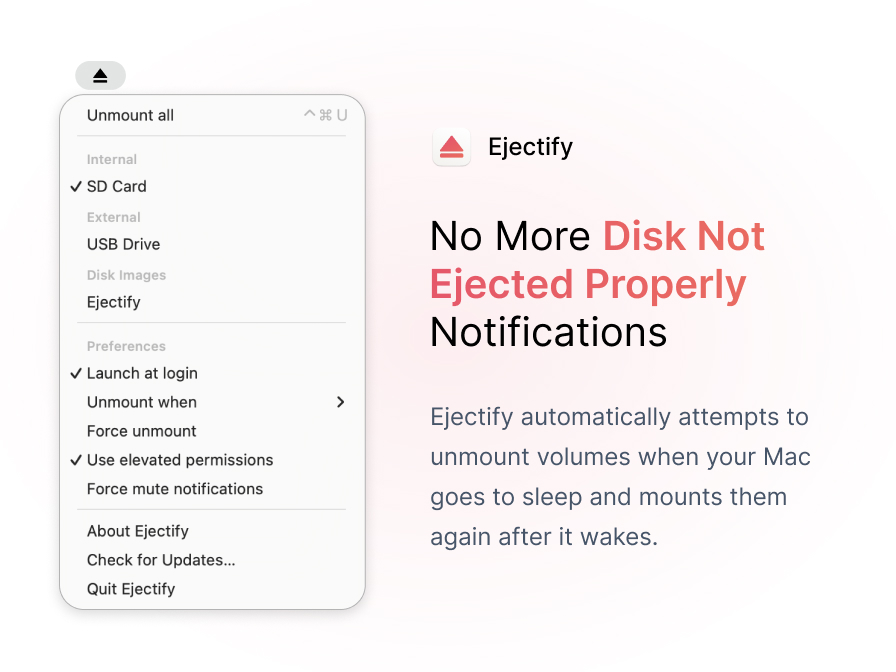

| This project comes without assistance or support. |
| --- |

# Ejectify for Mac

[Ejectify](https://ejectify.app) automatically unmounts external volumes when your Mac starts sleeping and mounts them again after it wakes up. It becomes handy when you have connected a USB drive to an external display that gets powered off when your Mac starts sleeping, causing the drive to be ejected forcefully.  

## Features

⭐ Prevents annoying *Disk not ejected properly* notifications when your Mac wakes up.

⭐ Prevents connected external disks and their volumes from getting corrupted.

⭐ Configure what volumes should be (un)mounted automatically, optionally forcefully.

⭐ Available in English, Dutch, German, French, Spanish, Russian, Japanese, Portuguese, Hindi and Arabic.

⭐ Configure when volumes should be unmounted:

- When the screensaver starts.
- When the screen is locked.
- When the screens started sleeping.
- When the system starts sleeping.

⭐ Automatically mount volumes again when your Mac or screens wake up, optionally after a delay.

⭐ Unmount all volumes instantly with the click of a button.

## Download

[Download Ejectify](https://gum.co/ejectify) via Gumroad. A small fee is requested to cover Apple's Developer Program fee. Alternatively, feel free to clone this repository (for free) and build a runnable application yourself.

## Frequently asked questions

### I'm running into an issue. How can I get help?
Ejectify comes without (human) support. Check the frequently asked questions below to solve most common issues. If you want to test Ejectify before purchasing (to cover Apple's Developer Program fee), feel free to clone this repository (for free) and build a runnable application yourself.

### The app doesn't start. What can I do?

Make sure Ejectify is copied into your Applications directory and run from there. Also, note that the app lives in the menu bar of your Mac. There should be an eject icon somewhere near your clock. There is no other user interface that pops up when you start it.

### Why do I still receive notifications?

Ejectify works by (trying to) unmount volumes (on external disks) before your screensaver starts, screen locks, display(s) turns off, or the system starts sleeping. Sometimes this doesn't result in the desired behavior. In this case, try the following:

- Ensure the correct volumes are checked in Ejectify's status bar menu. Ejectify will only attempt to unmount those.

- Toggle between the various `Unmount when` options. Depending on your (hardware) configuration, some options work better than others.

- If you've connected the disk via a USB hub, temporarily attach it directly to your Mac and test if that makes a difference.

- Temporary check `Force unmount` to see if that makes a difference. This (unsafe) option (almost) immediately ejects disks, even when apps or macOS still use it, which could result in data loss. When this resolves the issue, it's likely that an app or macOS is causing the issue. See [this page](https://serverfault.com/a/159428) to find out which app.

- Use the [Console app](https://support.apple.com/en-gb/guide/console/welcome/mac) to see if any warnings or errors are popping up that might indicate why Ejectify isn't able to (un)mount the disk. Specifically, look for a message starting with `Dissenter status`, which includes the result of the (un)mount process.

- Verify whether the volume is [encrypted](https://support.apple.com/guide/disk-utility/dskutl35612/mac). Users have [reported issues](https://github.com/nielsmouthaan/ejectify-macos/issues/34) with Ejectify when using encrypted volumes. If you experience the same, try [running Ejectify with administrator rights](https://github.com/nielsmouthaan/ejectify-macos/issues/34#issuecomment-1038299356) and verify if this (temporarily) solves the issue.

Ejectify might not (always) prevent notifications to appear. This is mostly caused by external hardware (such as USB hubs).

### Does Ejectify support Apple Silicon?

Yes, it does. Ejectify is built as an [Universal macOS Binary](https://developer.apple.com/documentation/apple-silicon/building-a-universal-macos-binary), meaning it natively supports Intel and Apple Silicon processors.

## License

Ejectify is available under the MIT license and uses source code from open-source projects. See the [LICENSE](https://github.com/nielsmouthaan/ejectify-macos/blob/main/LICENSE) file for more info.
