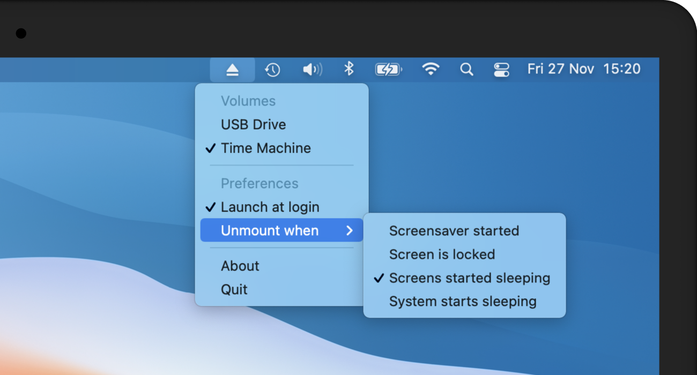

# Ejectify for Mac

Ejectify is a simple but useful menu bar app, that automatically unmounts external volumes when your Mac starts sleeping, and mounts them again after your Mac wakes up. It becomes handy when you have connected a USB drive to an external display that gets powered off when your Mac starts sleeping, causing the drive to be ejected forcefully.  

## Features

* [X] Prevents annoying "Disk not ejected properly" notifications when your Mac wakes up.
* [X] Prevents connected external disks and their volumes to get corrupted.
* [X] Configure what volumes should be unmounted automatically (all by default).
* [X] Configure when volumes should be unmounted:
  * When the screensaver starts.
  * When the screen is locked.
  * When the screens started sleeping.
  * When the system starts sleeping (default).

## Download
A binary will soon be available for download. Until then, feel free to clone this repository and build your own binary.
  
## Communication

🐛 If you found a bug, open an [issue](https://github.com/nielsmouthaan/ejectify-macos/issues).

💡 If you have a feature request, open an [issue](https://github.com/nielsmouthaan/ejectify-macos/issues).

🧑‍💻 If you want to contribute, submit a [pull request](https://github.com/nielsmouthaan/ejectify-macos/pulls).

## License

Ejectify is available under the MIT license and uses source code from open source projects. See the [LICENSE]([LICENSE](https://github.com/nielsmouthaan/ejectify-macos/blob/main/LICENSE)) file for more info.
