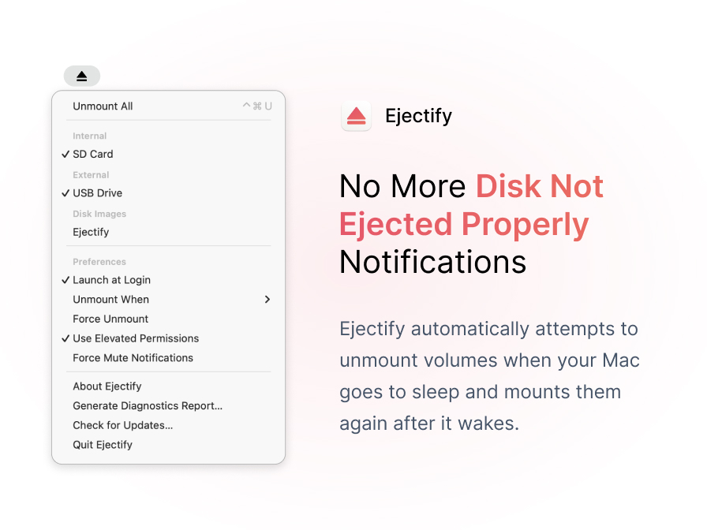

# Ejectify for Mac

[Ejectify](https://ejectify.app) is a Mac menu bar utility that helps prevent “Disk Not Ejected Properly” notifications by safely unmounting selected volumes when your Mac starts sleeping or the display turns off, then attempting to mount them again after wake.

 

## Features

- Helps prevent "Disk Not Ejected Properly" notifications after wake.
- Helps reduce the risk of data loss or corrupted volumes by safely unmounting them first.
- Lets you choose which supported volumes Ejectify manages, including external volumes, ejectable internal volumes, and disk images.
- Supports automatic unmounting when the display turns off or the system starts sleeping, then attempts to mount volumes again after wake.
- Includes force unmount, force mute notifications, and instant "Unmount all" actions, plus a global keyboard shortcut for manual unmount-all.
- Available in more than 30 languages.

## Download

[Get Ejectify](https://ejectify.app/get) or build it yourself from this repository.

## FAQ & Support

First, check the [FAQ on Ejectify's website](https://ejectify.app/#faq). If your question or issue is not listed, or you have a suggestion, open an [issue](https://github.com/nielsmouthaan/ejectify-macos/issues/new/choose).

## Contribution

Contributions are welcome. Feel free to fork the repository and submit a pull request.

## License

Ejectify is available under the MIT license and uses source code from open-source projects. See [LICENCE](https://github.com/nielsmouthaan/ejectify-macos/blob/main/LICENSE) for more info.
